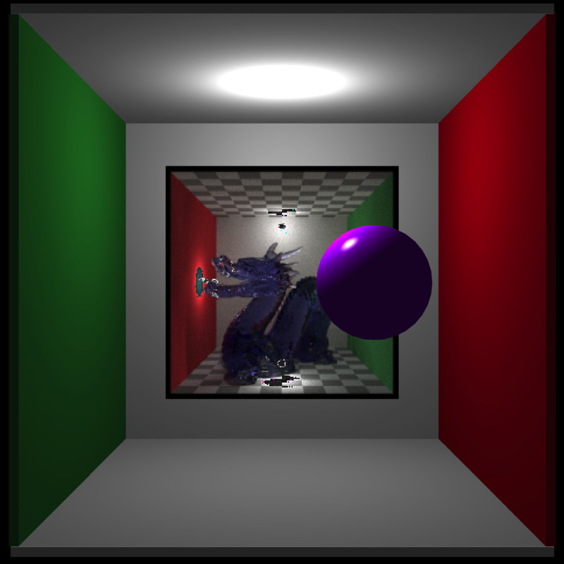
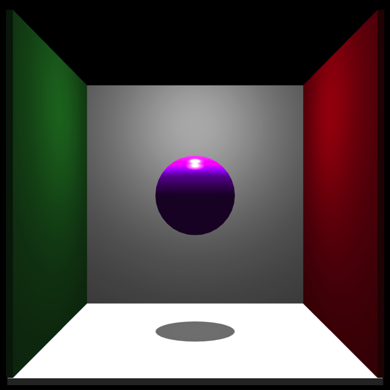
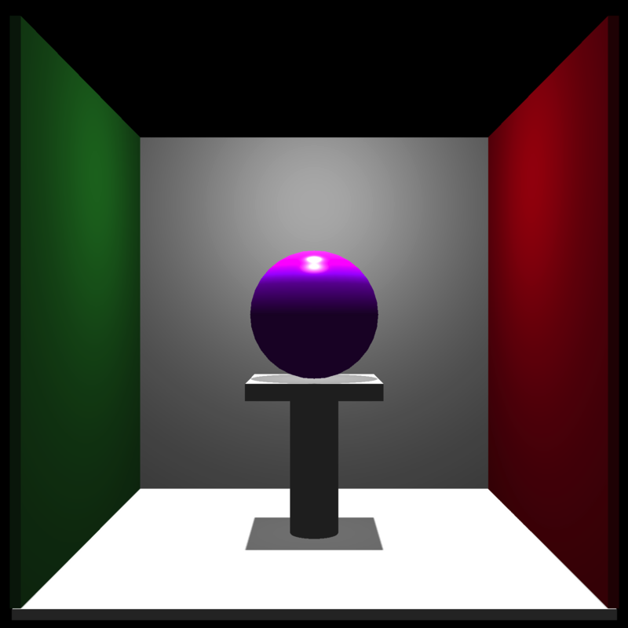
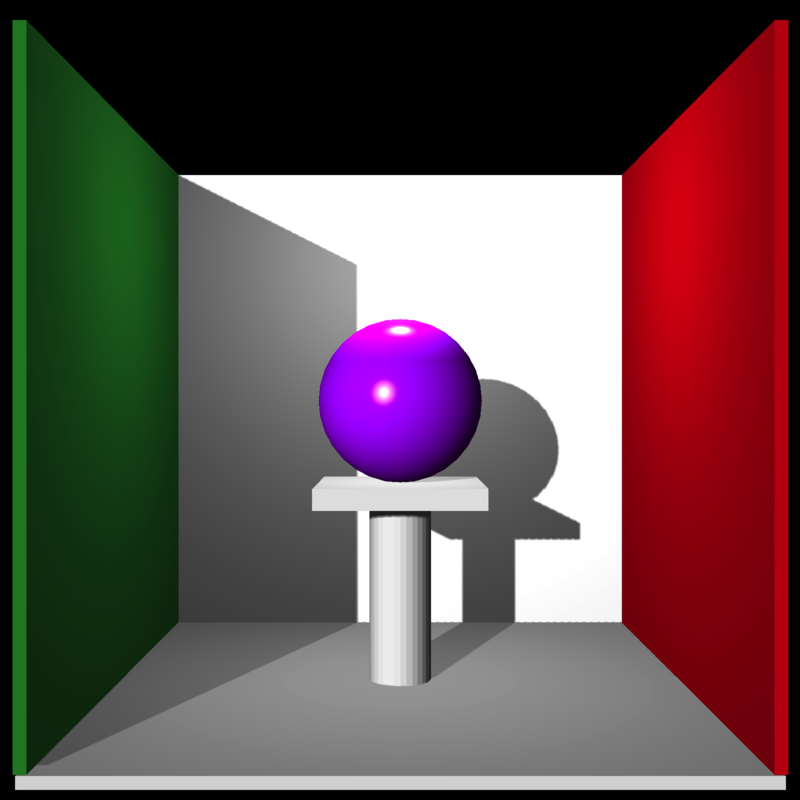

<!-- README.md is generated from README.Rmd. Please edit that file -->

# rayvertex

</img> <!-- badges: start -->
<!-- badges: end -->

Rayvertex is a 3D software renderer that allows you to generate 3D
visualizations without worrying about hardware requirements or
dependencies. It uses rasterization: a method that transforms meshes of
triangles into an image. These meshes are specified entirely in R, and
can be built either by importing external files, building scenes out of
the included objects, or by constructing the mesh yourself. Rayvertex
also allows the user to add any number of point lights and directional
lights to a scene, and support anti-aliased lines, shadow mapping,
transparent (and translucent) objects.

## </img>

Rayvertex features the following:

-   Multicore tiled rendering
-   User-specified render resolution
-   Multiple material shader types:
    -   Diffuse
    -   Phong
    -   Vertex
    -   Toon (cel) shading
    -   Flat shading
-   Built in shapes:
    -   Sphere, cube, cylinder, segment, cone, arrow, torus, and plane
    -   OBJ file support
    -   `mesh3d` support
-   Built-in mesh transformations:
    -   Rotation, translation, and scale
-   Support for normal maps, emission maps, ambient maps, and textures
-   Support for multiple point lights and directional lights with shadow
    mapping
-   Support for multicolor 3D line rasterization (both basic and
    anti-aliased)
-   Hashed material IDs for efficient memory use
-   Order-independent transparency rendering
-   Orthographic and projective cameras
-   Screen-space ambient occlusion
-   Translucent (tinted) shadows
-   Reflection Maps
-   Refractive Materials
-   Bloom
-   Tone mapping
-   Environment Maps

Meshes and scenes are specified via list structure that contains the
following:

-   A list of shapes that each include:
    -   An integer matrix of indices
    -   (optional) An integer matrix of indices for normal values
    -   (optional) An integer matrix of indices for texture coordinates
    -   A vector of material IDs, indexing into the following material
        property list
    -   A logical vector, indicating whether each vertex has normals
    -   A logical vector, indicating whether each vertex has texture
        coordinates
-   A list of material properties. Rayvertex looks for the following:
    -   Diffuse color
    -   Ambient color
    -   Specular color
    -   Transmittance color
    -   Emission color
    -   Shininess (specular exponent)
    -   Index of refraction (ior)
    -   Dissolve (transparency)
    -   Illumination model
    -   Diffuse Texture Image Filename
    -   Ambient Texture Image Filename
    -   Emissive Texture Image Filename
    -   Ambient Texture Image Filename
    -   Normal Texture Image Filename
    -   Diffuse Intensity
    -   Ambient Intensity
    -   Emissive Intensity
    -   Ambient Intensity
    -   Culling type
    -   Shader type
    -   Translucency
    -   Number of Toon levels
    -   Reflection Intensity
-   A 3xN matrix of vertex positions
-   A 2xN matrix of texture coordinates for each vertex
-   A 3xN matrix of normals for each vertex
-   A vector of material hashes. This can save memory by only adding a
    new material when it does not already exist in the object.

Rayvertex includes a series of helper functions that allow you to
generate, translate, and scale meshes.

You can install rayvertex from [GitHub](https://github.com/) with:

``` r
# install.packages("devtools")
devtools::install_github("tylermorganwall/rayvertex")
```

## Example

Here, we will render a basic scene. We’ll use the built-in Cornell Box
mesh to begin.

``` r
library(rayvertex)

generate_cornell_mesh() %>% 
  rasterize_scene()
#> Setting default values for Cornell box: lookfrom `c(278,278,-800)` lookat `c(278,278,0)` fov `40` .
```


Let’s add a purple sphere to the center:

``` r
mat = material_list(diffuse="purple", type = "phong", ambient="purple", ambient_intensity = 0.2)

generate_cornell_mesh() %>% 
  add_shape(sphere_mesh(position=c(555,555,555)/2, radius=80, material=mat)) %>% 
  rasterize_scene()
#> Setting default values for Cornell box: lookfrom `c(278,278,-800)` lookat `c(278,278,0)` fov `40` .
```



Now, the ceiling of the Cornell Box is blocking the directional light.
Let’s remove it.

``` r
generate_cornell_mesh(ceiling=FALSE) %>% 
  add_shape(sphere_mesh(position=c(555,555,555)/2, radius=80, material=mat)) %>% 
  rasterize_scene()
#> Setting default values for Cornell box: lookfrom `c(278,278,-800)` lookat `c(278,278,0)` fov `40` .
```



Let’s add a cylinder and a platform to the bottom of our sphere.

``` r
mat2 = material_list(diffuse="grey80", ambient="grey80", ambient_intensity = 0.2)

generate_cornell_mesh(ceiling=FALSE) %>% 
  add_shape(sphere_mesh(position=c(555,555,555)/2, radius=80, material=mat)) %>% 
  add_shape(segment_mesh(start=c(555/2,0,555/2),end=c(555/2,196,555/2), 
                         radius=30, material=mat2)) %>% 
  add_shape(cube_mesh(position=c(555/2,555/2-90,555/2), 
                      scale=c(160,20,160),material=mat2)) %>% 
  rasterize_scene()
#> Setting default values for Cornell box: lookfrom `c(278,278,-800)` lookat `c(278,278,0)` fov `40` .
```



Now let’s change the angle of the directional light so it’s angled from
the front :

``` r
generate_cornell_mesh(ceiling=FALSE) %>% 
  add_shape(sphere_mesh(position=c(555,555,555)/2, radius=80, material=mat)) %>% 
  add_shape(segment_mesh(start=c(555/2,0,555/2),end=c(555/2,196,555/2), 
                         radius=30, material=mat2)) %>% 
  add_shape(cube_mesh(position=c(555/2,555/2-90,555/2), 
                      scale=c(160,20,160),material=mat2)) %>% 
  rasterize_scene(light_info = directional_light(c(0.4,0.2,-1)))
#> Setting default values for Cornell box: lookfrom `c(278,278,-800)` lookat `c(278,278,0)` fov `40` .
```



And let’s add all the other basic mesh shapes included in the package
(including the included OBJ file and the `humface` mesh3d object from
the Rvcg package):

``` r
library(Rvcg)
#> Warning: package 'Rvcg' was built under R version 3.6.2
data(humface)

cols = hsv(seq(0,1,length.out=6))

mats = list()
for(i in 1:5) {
  mats[[i]] = material_list(diffuse=cols[i], ambient=cols[i], type="phong",
                            ambient_intensity = 0.2)
}

generate_cornell_mesh(ceiling=FALSE) %>%
  add_shape(sphere_mesh(position=c(555,555,555)/2, radius=80, material=mat)) %>%
  add_shape(segment_mesh(start=c(555/2,0,555/2),end=c(555/2,196,555/2),
                         radius=30, material=mat2)) %>%
  add_shape(cube_mesh(position=c(555/2,555/2-90,555/2),
                      scale=c(160,20,160),material=mat2)) %>%
  add_shape(torus_mesh(position=c(100,100,100), radius = 50, ring_radius = 20,
                       angle=c(45,0,45),material=mats[[1]])) %>%
  add_shape(cone_mesh(start=c(555-100,0,100), end=c(555-100,150,100), radius = 50,
                      material=mats[[2]])) %>%
  add_shape(arrow_mesh(start=c(555-100,455,555-100), end=c(100,455,555-100),
                       radius_top = 50, radius_tail=10, tail_proportion = 0.8,
                       material=mats[[3]])) %>%
  add_shape(obj_mesh(r_obj(), position=c(100,200,555/2), angle=c(-10,200,0),
                     scale=80,material=mats[[4]])) %>%
  add_shape(mesh3d_mesh(humface, position = c(555-80,220,555/2),scale = 1,
                        material=mats[[5]],angle=c(0,180,-30))) %>% 
  rasterize_scene(light_info = directional_light(c(0.4,0.2,-1)))
#> Setting default values for Cornell box: lookfrom `c(278,278,-800)` lookat `c(278,278,0)` fov `40` .
```


We can also draw shapes with toon shading:

``` r
set.seed(1)
col = hsv(runif(1))
scene = sphere_mesh(position=runif(3),
                    material=material_list(diffuse=col, type="toon",toon_levels = 3, 
                                           toon_outline_width = 0.025,
                                           ambient=col,ambient_intensity=0.2),radius=0.1)

for(i in 1:30) {
  col = hsv(runif(1))
  scene = add_shape(scene, sphere_mesh(position=runif(3),
                                       material=material_list(diffuse=col, type="toon",toon_levels = 3,
                                                              toon_outline_width = 0.025,
                                                              ambient=col, ambient_intensity=0.2),
                                       radius=0.1))
}

rasterize_scene(scene, light_info=directional_light(direction=c(0.5,0.8,1)),
                background = "white",fov=10)
#> Setting `lookat` to: c(0.53, 0.49, 0.50)
```


You can also include a environment map to use for reflective,
semi-reflective, and refractive surfaces. The roughness of the
reflection can be controlled on a per-material basis with the
`reflection_sharpness` argument.

``` r
tempfilehdr = tempfile(fileext = ".hdr")
download.file("https://www.tylermw.com/data/venice_sunset_2k.hdr",tempfilehdr)

scene = torus_mesh(position=c(0.4,0,0),angle=c(-30,20,-30),
                   material=material_list(diffuse=c(1,1,1), type="color", 
                                           reflection_intensity = 1.0, reflection_sharpness = 0.2),
                   ring_radius=0.05,radius=0.2) %>% 
  add_shape(torus_mesh(position=c(0.4,0.5,0),angle=c(-30,20,-130),
                   material=material_list(diffuse="green", ambient="green", type="phong", 
                                          ambient_intensity = 0.2, diffuse_intensity=0.8,
                                          reflection_intensity = 0.5, reflection_sharpness = 0.05),
                   ring_radius=0.05,radius=0.2)) %>% 
  add_shape(sphere_mesh(position=c(-0.4,0,0),
                   material=material_list(diffuse="white", type="color",ior=1.6),radius=0.2)) %>% 
  add_shape(obj_mesh(r_obj(),position=c(-0.4,0.35,0),scale=0.2, angle=c(0,-30,0),
                   material=material_list(diffuse="purple", type="color",ior=1.6))) %>% 
  add_shape(sphere_mesh(position=c(0,0.25,0),
                   material=material_list(diffuse="white", type="color",reflection_intensity = 1.0),
                   radius=0.2)) 

rasterize_scene(scene, lookat=c(0,0.25,0),
                light_info=directional_light(direction=c(0.5,1,1)),
                lookfrom=c(0,0.5,2.5), 
                fov=30, environment_map = tempfilehdr)
```


You can also blur the background but keep the reflections sharp by
setting the `background_sharpness` argument to draw focus to your 3D
scene.

``` r
rasterize_scene(scene, lookat=c(0,0.25,0),
                light_info=directional_light(direction=c(0.5,1,1)),
                lookfrom=c(0,0.5,2.5), 
                fov=30, environment_map = tempfilehdr, background_sharpness = 0.5)
```


Now let’s draw another example scene: we’ll add the R OBJ to a flat
surface.

``` r
base_model = cube_mesh() %>%
  scale_mesh(scale=c(5,0.2,5)) %>%
  translate_mesh(c(0,-0.1,0)) %>%
  set_material(diffuse="white")

r_model = obj_mesh(r_obj()) %>%
  scale_mesh(scale=0.5) %>%
  set_material(diffuse="red") %>%
  add_shape(base_model)

rasterize_scene(r_model, lookfrom=c(2,4,10),fov=20,
               light_info = directional_light(direction=c(0.8,1,0.7)))
#> Setting `lookat` to: c(0.00, 0.34, 0.00)
```


We can reduce the shadow intensity so the shadows aren’t black.
Alternatively, you can add an `ambient` term to the material.

``` r
#Zoom in and reduce the shadow mapping intensity
rasterize_scene(r_model, lookfrom=c(2,4,10), fov=10,shadow_map = TRUE, shadow_map_intensity=0.3,
               light_info = directional_light(direction=c(0.8,1,0.7)))
#> Setting `lookat` to: c(0.00, 0.34, 0.00)
```


We can increase the resolution of the shadow map to increase the
fidelity of the shadows. This can reduce the amount of “pixelation”
around the edges.

``` r
rasterize_scene(r_model, lookfrom=c(2,4,10), fov=10,
                shadow_map_dims=2, light_info = directional_light(direction=c(0.8,1,0.7)))
#> Setting `lookat` to: c(0.00, 0.34, 0.00)
```


We can add multiple directional lights and change their color and
intensity:

``` r
lights = directional_light(c(0.7,1.1,-0.9),color = "orange",intensity = 0.7) %>%
            add_light(directional_light(c(0.7,1,1),color = "dodgerblue",intensity = 0.7)) %>%
            add_light(directional_light(c(2,4,10),color = "white",intensity = 0.3))
rasterize_scene(r_model, lookfrom=c(2,4,10), fov=10,
               light_info = lights)
#> Setting `lookat` to: c(0.00, 0.34, 0.00)
```


We can change the transparency of the material, which allows for colored
shadows.

``` r
r_model_t = obj_mesh(r_obj()) %>%
  scale_mesh(scale=0.5) %>%
  set_material(diffuse="red", dissolve=0.5, translucent = T) %>%
  add_shape(base_model)

r_model_t = obj_mesh(r_obj(),c(-2,0,0.3)) %>%
  scale_mesh(scale=0.5) %>%
  set_material(diffuse="dodgerblue", dissolve=0.5, translucent = T) %>%
  add_shape(r_model_t)

rasterize_scene(r_model_t, lookfrom=c(2,4,10),fov=15,lookat=c(-0.5,0,0),
                light_info = directional_light(direction=c(0.8,1,0.7), intensity = 0.5) %>% 
                   add_light(directional_light(direction=c(-0.8,1,0.7),intensity = 0.5)))
```


We can also add some point lights:

``` r
#Add some point lights
lights_p = lights %>%
  add_light(point_light(position=c(-1,1,0),color="red", intensity=2)) %>%
  add_light(point_light(position=c(1,1,0),color="purple", intensity=2))

rasterize_scene(r_model, lookfrom=c(2,4,10), fov=10,
               light_info = lights_p)
#> Setting `lookat` to: c(0.00, 0.34, 0.00)
```


We can change the camera position by adjusting the `lookfrom` argument:

``` r
#change the camera position
rasterize_scene(r_model, lookfrom=c(-2,2,-10), fov=10,
               light_info = lights_p)
#> Setting `lookat` to: c(0.00, 0.34, 0.00)
```


Finally, we can also add 3D lines to the scene. We’ll add a spiral of
lines around the R.

``` r
t = seq(0,8*pi,length.out=361)
line_mat = matrix(nrow=0,ncol=9)

for(i in 1:360) {
  line_mat = add_lines(line_mat,
                      generate_line(start = c(0.5*sin(t[i]), t[i]/(8*pi), 0.5*cos(t[i])),
                                    end  = c(0.5*sin(t[i+1]), t[i+1]/(8*pi), 0.5*cos(t[i+1]))))
}

rasterize_scene(r_model, lookfrom=c(2,4,10), fov=10, line_info = line_mat,
               light_info = lights)
#> Setting `lookat` to: c(0.00, 0.34, 0.00)
```


