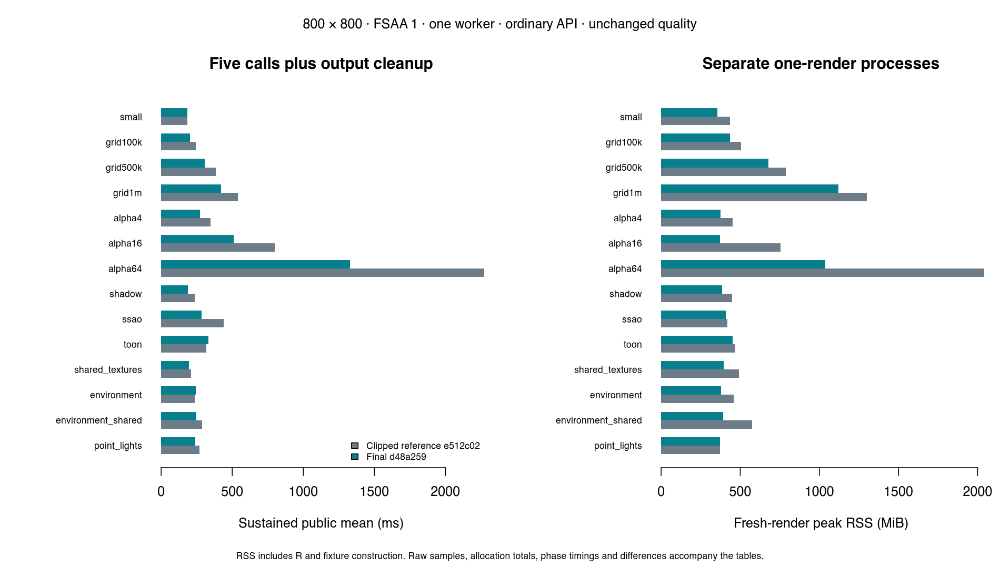

# Final workload interpretation

This compares the ordinary API at corrected clipping checkpoint `e512c02` with final renderer `d48a259`, at 800×800 / FSAA 1 / one worker. Earlier sparse-transparency and setup/bin improvements already exist in this baseline; their own reports measure those phases. Correctness differences are tracked separately. See the [full table](results.md) for cold, warm median/p95, isolated native, sustained calls and fresh RSS, plus the CSV summaries for R allocations and diagnostic overhead.

## Where work remains

The following native stage medians come from three separately instrumented runs. The coarse R output interval is a single verbose diagnostic boundary from native return to the display/save label, with plotting and file encoding disabled. It includes R processing and may include GC; it is not a precise breakdown into conversion, resize and allocation. The interpretation combines these observations with the ordinary timing table. No bandwidth/compute classification is inferred from uncollected hardware counters.

| Workload | Largest final native stage (ms) | Coarse R output interval (ms) | Interpretation |
|---|---:|---:|---|
| small | `main_coverage_depth_shading` 3.6 | 162.0 | R output/GC dominates the public call; native coverage and allocation are small. |
| grid100k | `main_coverage_depth_shading` 19.6 | 151.0 | R output dominates the public call; coverage and geometry setup are the largest native work. |
| grid500k | `main_coverage_depth_shading` 54.7 | 120.0 | Geometry setup and coverage both matter; R output remains substantial. |
| grid1m | `main_transform_setup` 85.8 | 139.0 | Geometry and coverage dominate native time; setup storage and varyings dominate native payload. |
| alpha4 | `main_coverage_depth_shading` 51.7 | 126.0 | R output is substantial; native fragment production and resolve remain the main work. |
| alpha16 | `main_coverage_depth_shading` 182.4 | 141.0 | Fragment production and sorting/resolution dominate native time. |
| alpha64 | `main_coverage_depth_shading` 587.4 | 153.0 | Fragment production and sorting/resolution dominate; retained record capacity is the large native payload. |
| shadow | `main_coverage_depth_shading` 14.5 | 158.0 | R output dominates this fixture; exact PCF specialization reduces main shading cost. |
| ssao | `ssao` 86.8 | 153.0 | SSAO is the largest native stage; R output remains substantial. |
| toon | `outlines` 113.8 | 142.0 | Outline work dominates native time. The public regression is retained and repeated separately. |
| shared_textures | `main_coverage_depth_shading` 12.3 | 160.0 | R output dominates; per-frame shared material decode is a small native stage. |
| environment | `main_coverage_depth_shading` 28.5 | 151.0 | R output dominates; shading and background sampling remain. The small public regression is unresolved. |
| environment_shared | `main_coverage_depth_shading` 28.1 | 132.0 | R output dominates; sharing removes redundant variant work but not per-frame source decode. |
| point_lights | `main_coverage_depth_shading` 55.7 | 162.0 | R output dominates public time; main lighting/coverage dominates native time. |

The earlier native sampling profile found repeated geometry accessor work and motivated stable raw views; its [full sample](../geometry/validation/structural-native-profile.txt) and [phase measurements](../geometry/results.md) are retained. Stage clocks do not independently resolve forward coverage versus shading, and Rprofmem omits C++ allocations. Fragment/varying/variant counters measure their named payloads rather than total process memory.

## Regressions and defaults

The broad table retains small-scene warm median 182→193 ms, toon sustained mean 318.8→333.2 ms, and environment sustained mean 237.6→242.8 ms. The [three-round follow-up](../regression-loops/results.md) finds median process means of 184.0→176.7 ms (small), 317.4→324.5 ms (toon), and 232.8→234.1 ms (environment). Toon is a repeated application-level regression despite a native improvement; its cause is not established. Full-buffer controls do not recover its baseline. No uniform end-to-end speedup is claimed.

The equivalent structural defaults are retained for substantial layered-transparency, larger-geometry, shadow and SSAO benefits, with these public regressions disclosed. At one million triangles, varying payload falls from 481,213,440 to 312,788,736 bytes; at alpha64 fragment capacity falls from 2,093,407,872 to 917,725,944 bytes. Fresh RSS is lower in the 14-case final table (point lights effectively unchanged), but earlier individual phases and prepared-scene cases contain increases and remain reported. Returning fewer requested/debug buffers or reducing quality was not used.

The [worker sweep](../workers/results.md) retains user/core limits and improves scaling in layered transparency and SSAO. Ten workers is the measured endpoint for this 8-performance/2-efficiency-core machine, not a portable optimum. Existing 4×4 coverage blocks and batches of 64 remain defaults; the earlier batch sweep supplied that choice. A spatial macrotile layout was not implemented.

Visibility and indexed transforms stay opt-in. The [visibility sweep](../visibility-expanded/results.md) demonstrates fewer shader calls and lower time for eligible opaque overdraw, but does not prove a general win for low-overdraw, small, textured or mixed materials. The [prepared-scene report](../prepared/results.md) accounts for preparation plus first render and repeated reuse separately; preparation is not free and several small cases do not amortize within the measured sample.

At 1920×1080 / FSAA 2 / four workers, the [quality sweep](../quality/results.md) measures the 100k mesh at 348→95 ms native versus 2305→2065 ms public, with fresh RSS 4363.9→3149.6 MiB. The unchanged R output path now limits the observed application gain. All 238 broad-table, 272 worker-sweep, 187 quality-sweep and 102 visibility-sweep image/buffer comparisons are exact. See [validation](../validation.md) for larger regression corpora and sanitizer limitations, and [remaining scope](../remaining.md) for unimplemented experiments.
